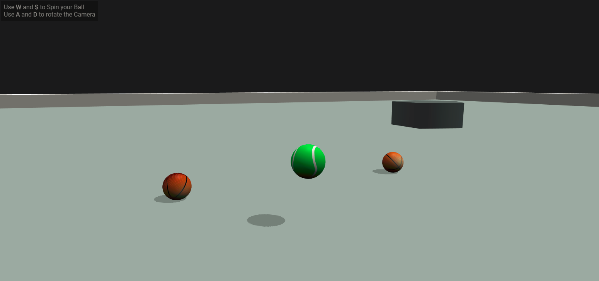

## Multiplayer Babylon JS "Game" with Client & Server-Side Physics Engine



You can open the Demo in two different browser tabs, that way you spawn two different players into the world
<br>Demo here: http://185.82.21.82:8700

#### Run Localy
```
>> cd client
>> npm install
>> tsc
>> npm start
```
In a new console:
```
>> cd server
>> npm install
>> tsc
>> npm start
```

Then visit http://localhost:8700. 

#### Development
If you want to play around with the code you can run `>> npm run dev`. (nodemon must be installed globaly). This will watch any chances for the typescript files, recompiles and on the server side, also restarts the server to serve the changes. 


### What is this?
Testing the server side "NullEngine()" from Babylon.js. This enables you to run Babylon.js on a node server without having to render anything to the screen. That means you can simulate the world on your Clients as well as on the Server. 

This implementation uses Websockets for Client <-> Server communication. The physics engine is simulating on Client as well on the Server. The Server then sends each render loop updates to all clients about the current "State of the World". The Clients then adjust the World according to the Server updates. That means, the higher the delay, the more visible "jumps" can occur. Interpolation could smooth out this jumps, but is currently not implemented.

### The "game"
Granted, it is not really a game. It is just an "arena" where each player controls a ball. By pressing `W` or `D` you can give the ball a spin forward or backward into the camera direction.<br>
With `A` and `D` you can rotate the camera around the ball to apply the spin from different directions. With `SPACE` you can jump (only working on the ground as it is hacked in...)<br>
The plan was (or is) that you would have to try to push your opponents of the arena, but this is not implemented yet. Right now you just fall forever and have to reload the page (That is why there are walls around the arena for now : ). 